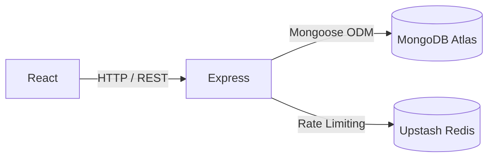
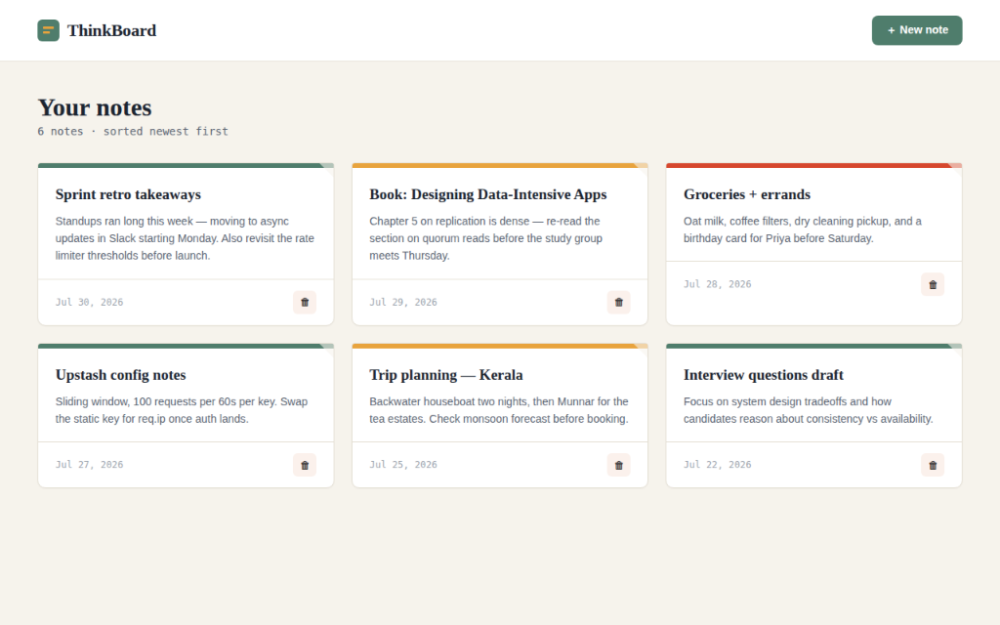
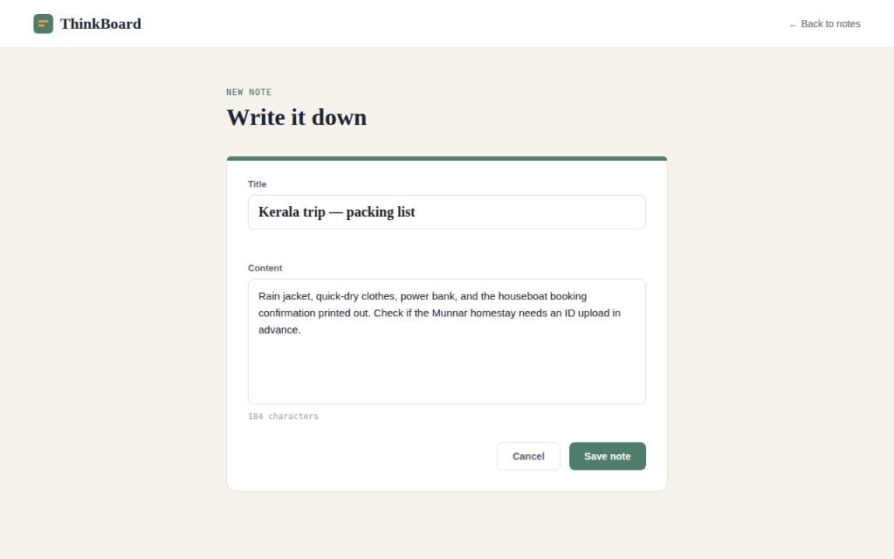
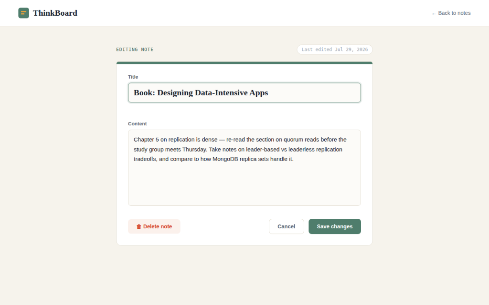
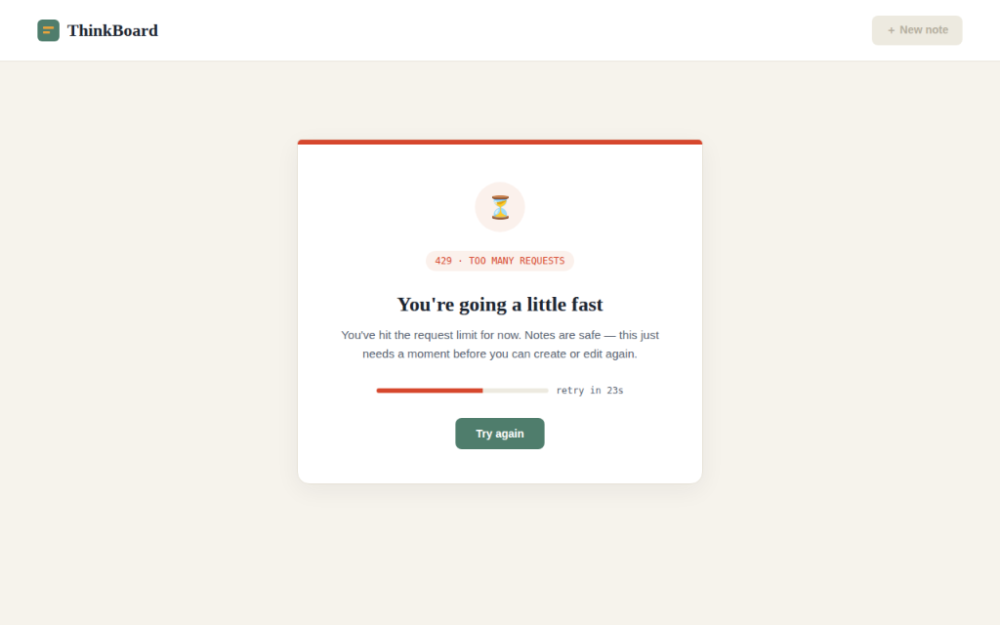

# 🧠 ThinkBoard

<div align="center">

[](https://react.dev/)
[](https://nodejs.org/)
[](https://expressjs.com/)
[](https://www.mongodb.com/atlas)
[](https://vitejs.dev/)
[](https://tailwindcss.com/)
[](https://upstash.com/)
[](LICENSE)

**A full-stack MERN notes application with Redis-backed rate limiting and a production-ready single-service deployment.**

[🚀 Live Demo](#) · [🐛 Report Bug](https://github.com/SUDHARSHANKUPPILI/mern-thinkboard/issues) · [💡 Request Feature](https://github.com/SUDHARSHANKUPPILI/mern-thinkboard/issues)

</div>

---

## About

ThinkBoard is a notes management application built with MongoDB, Express, React, and Node.js. It provides a clean interface for creating, editing, and deleting personal notes, backed by a RESTful API protected with Upstash Redis rate limiting. In production, Express serves the Vite build statically — a single deployable Node.js service with no separate frontend server required.

---

## Features

- Create, edit, and delete notes with a title and content
- RESTful CRUD API with consistent JSON responses
- MongoDB Atlas integration via Mongoose
- Redis-backed rate limiting with a dedicated 429 UI and countdown timer
- Client-side routing with React Router v7
- Toast notifications for all user actions
- Environment-aware API base URL (switches automatically between dev and production)
- Responsive card grid layout built with Tailwind CSS

---

## Tech Stack

| Layer | Technologies |
|---|---|
| **Frontend** | React, React Router, Vite, Tailwind CSS, Axios, Lucide React, react-hot-toast |
| **Backend** | Node.js, Express.js, Mongoose, dotenv, cors, nodemon |
| **Database** | MongoDB Atlas |
| **Infrastructure** | Upstash Redis |
| **Deployment** | Render |

---

## Architecture



Every request from the React SPA hits the Express API, where a Redis-backed middleware enforces rate limits before any controller logic runs. In production, Express also serves the Vite-compiled frontend from `frontend/dist/`.

---

## Screenshots

| Home Page | Create Note |
|---|---|
|  |  |

| Edit Note | Rate Limit (429) |
|---|---|
|  |  |

---

## Installation

```bash
# Clone the repository
git clone https://github.com/SUDHARSHANKUPPILI/mern-thinkboard.git
cd mern-thinkboard

# Install backend dependencies
cd backend && npm install

# Install frontend dependencies
cd ../frontend && npm install
```

---

## Environment Variables

Create `backend/.env`:

```env
PORT=5001
NODE_ENV=development

MONGO_URI=mongodb+srv://<username>:<password>@cluster0.xxxxx.mongodb.net/<dbname>?retryWrites=true&w=majority

UPSTASH_REDIS_REST_URL=https://xxxx.upstash.io
UPSTASH_REDIS_REST_TOKEN=your_token_here
```

| Variable | Source |
|---|---|
| `MONGO_URI` | MongoDB Atlas → Connect → Drivers |
| `UPSTASH_REDIS_REST_URL` / `TOKEN` | Upstash Console → Redis DB → REST API |

> `.env` is already listed in `.gitignore` — never commit it.

---

## Running Locally

```bash
# Terminal 1 — Backend (http://localhost:5001)
cd backend && npm run dev

# Terminal 2 — Frontend (http://localhost:5173)
cd frontend && npm run dev
```

---

## API Reference

All endpoints are prefixed with `/api` and protected by the rate limiter.

| Method | Endpoint | Description |
|--------|----------|-------------|
| `GET` | `/api/notes` | Fetch all notes, newest first |
| `GET` | `/api/notes/:id` | Fetch a single note by ID |
| `POST` | `/api/notes` | Create a new note |
| `PUT` | `/api/notes/:id` | Update an existing note |
| `DELETE` | `/api/notes/:id` | Delete a note |

Exceeding the rate limit returns `HTTP 429 Too Many Requests`.

---

## Deployment

**Recommended: [Render](https://render.com)**

1. Connect your GitHub repository on [render.com](https://render.com)
2. **Build Command:** `npm run build`
3. **Start Command:** `npm start`
4. Add all environment variables from `backend/.env`
5. Deploy

> Setting `NODE_ENV=production` disables CORS and tells Express to serve the Vite build from `frontend/dist/`.

---

## Future Roadmap

- [ ] JWT Authentication
- [ ] Search & Filter
- [ ] Categories & Tags
- [ ] Dark Mode
- [ ] Rich Text Editor
- [ ] GitHub Actions CI/CD

---

## License

Distributed under the **MIT License**. See [`LICENSE`](LICENSE) for details.

---

## 👨‍💻 Author

**Sudharshan Kuppili**

[](https://github.com/SUDHARSHANKUPPILI)
[](https://linkedin.com/in/sudharshankuppili)

If you found this project useful, consider giving it a ⭐ — it helps others find it too.
